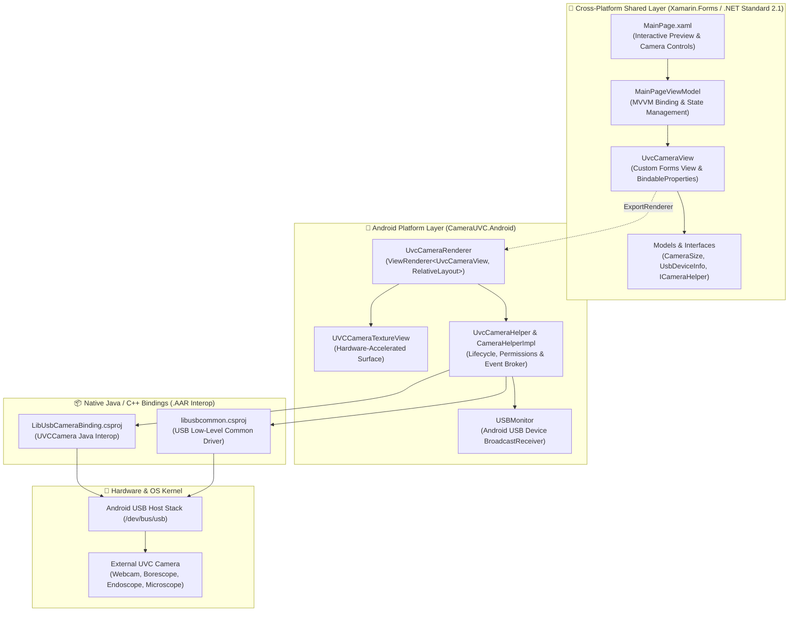

# Xamarin.Forms UVC Camera 📷🔌

[](https://docs.microsoft.com/en-us/dotnet/csharp/)
[](https://docs.microsoft.com/en-us/dotnet/standard/net-standard)
[](https://dotnet.microsoft.com/apps/xamarin/xamarin-forms)
[-3DDC84.svg?style=flat-square&logo=android)](https://developer.android.com)
[-FF6F00.svg?style=flat-square)](https://en.wikipedia.org/wiki/USB_video_device_class)
[]()
[](LICENSE)

> **High-performance USB Video Class (UVC) camera integration and capture library for Android built on Xamarin.Forms.** Connect external webcams, borescopes, industrial microscopes, and medical endoscopes directly via USB OTG with real-time hardware-accelerated preview, frame transformations, dynamic resolution negotiation, snapshot capture, and MP4 video recording.

---

## 🌟 Overview

Standard Android camera frameworks (`android.hardware.Camera` and `Camera2`) are architected strictly for internal mobile cameras and cannot directly interface with external USB Video Class (UVC) devices without manufacturer-specific drivers.

**XamarinUVCCamera** bridges this capability gap by coupling native Android USB Host APIs with C/Java native bindings (`libusb` and `UVCCamera`), wrapped in clean, decoupled **Xamarin.Forms Custom Controls and Renderers**. Developers can drop a `<local:UvcCameraView />` directly into their cross-platform XAML and command external cameras with idiomatic C#.

---

## 🏗️ System Architecture



---

## ✨ Key Features

- **🔌 Plug-and-Play USB Discovery**:
  Listens for real-time USB hot-plug events (`android.hardware.usb.action.USB_DEVICE_ATTACHED` and `DETACHED`) with automated permission prompts.
- **⚡ Hardware-Accelerated Preview**:
  Leverages low-overhead `UVCCameraTextureView` embedded via custom Android view renderer for minimal frame latency and optimal frame rates (up to 30/60 FPS depending on sensor).
- **📐 Dynamic Resolution Enumeration**:
  Interrogates connected UVC hardware descriptors at runtime to discover supported resolutions (e.g., QVGA `320x240`, VGA `640x480`, HD `1280x720`, Full HD `1920x1080`) with fallback safety.
- **🎥 Full HD Video Recording**:
  Encodes and muxes real-time video into `.mp4` containers using native hardware codecs.
- **📸 High-Resolution Still Snapshots**:
  Captures still JPEG snapshots directly from the frame stream into app-scoped or public external storage.
- **🔄 Live Video Transformations**:
  Supports real-time digital horizontal flip, vertical flip, and rotational adjustments (0°, 90°, 180°, 270°).
- **🧩 Clean & Decoupled Architecture**:
  Cross-platform UI code remains pure XAML/C#, communicating with platform services via clean dependency interfaces (`ICameraHelper`).

---

## 📁 Repository Structure

```text
XamarinUVCCamera/
├── CameraUVC/                          # Cross-Platform Core (.NET Standard 2.1)
│   ├── Interfaces/                     # Service abstractions & dependency contracts
│   │   └── ICameraHelper.cs            # Camera lifecycle & enumeration contract
│   ├── Models/                         # Domain models & event arguments
│   │   ├── CameraEventArgs.cs          # Strongly-typed camera event args
│   │   ├── CameraSize.cs               # Resolution dimension model
│   │   └── UsbDeviceInfo.cs            # USB device metadata model
│   ├── ViewModels/                     # MVVM presentation layer
│   │   └── MainPageViewModel.cs        # Camera view model with Commands
│   ├── App.xaml / App.xaml.cs          # Application entry point
│   ├── MainPage.xaml / MainPage.xaml.cs # Camera preview & interactive UI
│   └── UvcCameraView.cs                # Xamarin.Forms custom view definition
│
├── CameraUVC.Android/                  # Android Platform Implementation (API 21-30+)
│   ├── Renderers/                      # Xamarin.Forms Custom Renderers
│   │   └── UvcCameraRenderer.cs        # Maps UvcCameraView to UVCCameraTextureView
│   ├── Properties/                     # Manifest & Assembly configuration
│   │   └── AndroidManifest.xml         # USB device filters & permission declarations
│   ├── Resources/xml/                  # USB accessory & device filter configurations
│   │   └── device_filter.xml           # Class/subclass filters for UVC hardware
│   ├── MainActivity.cs                 # Android Activity entry point & USB lifecycle
│   └── UvcCameraHelper.cs              # Native UVC camera wrapper & USBMonitor service
│
├── LibUsbCameraBinding/                # C# Bindings for native libusbcamera.aar
│   └── Jars/libusbcamera-release.aar   # Pre-compiled native UVC camera driver
│
├── libusbcommon/                       # C# Bindings for native common-2.12.4.aar
│   └── Jars/common-2.12.4.aar          # Pre-compiled base USB communication driver
│
└── XamarinUVCCamera.sln                # Visual Studio Solution file
```

---

## 🚀 Getting Started

### Hardware Prerequisites
1. **Android Device** with USB Host support (Android 5.0 Lollipop / API 21 or higher).
2. **USB OTG Adapter** (USB-C or Micro-USB to USB-A Female).
3. **UVC-Compliant USB Camera** (Standard USB webcams from Logitech/Microsoft, industrial borescopes, inspection cameras, or medical endoscopes).

### Android Permissions & Device Filter
The application declares USB Host and camera permissions in `CameraUVC.Android/Properties/AndroidManifest.xml`:

```xml
<uses-feature android:name="android.hardware.usb.host" />
<uses-feature android:name="android.hardware.camera" />
<uses-permission android:name="android.permission.CAMERA" />
<uses-permission android:name="android.permission.WRITE_EXTERNAL_STORAGE" />
<uses-permission android:name="android.permission.READ_EXTERNAL_STORAGE" />
```

To auto-launch when an external camera is attached, `MainActivity` registers the USB filter in `Resources/xml/device_filter.xml`:

```xml
<resources>
    <!-- Filter for Video Class devices (Class 14 = 0x0E) -->
    <usb-device class="14" />
</resources>
```

---

## 💻 Code Usage

### 1. Declare in XAML
Embed the custom camera view anywhere in your layout:

```xml
<ContentPage 
    xmlns="http://xamarin.com/schemas/2014/forms"
    xmlns:x="http://schemas.microsoft.com/winfx/2009/xaml"
    xmlns:local="clr-namespace:CameraUVC;assembly=CameraUVC"
    x:Class="CameraUVC.MainPage">

    <Grid>
        <!-- Real-Time UVC Stream View -->
        <local:UvcCameraView 
            x:Name="CameraView"
            BackgroundColor="#1A1A1A"
            HorizontalOptions="FillAndExpand"
            VerticalOptions="FillAndExpand" />
    </Grid>
</ContentPage>
```

### 2. Connect, Preview, and Capture in C#
```csharp
using CameraUVC;
using CameraUVC.Models;
using CameraUVC.Interfaces;

// 1. Discover connected USB cameras
var cameras = CameraHelper.Instance.ListUsbDevices();
if (cameras.Length > 0)
{
    var camera = cameras[0];
    
    // 2. Query supported hardware resolutions
    CameraSize[] supportedSizes = CameraHelper.Instance.GetCameraSupportedSizes(camera.DeviceId);
    var selectedSize = supportedSizes.FirstOrDefault() ?? new CameraSize(1280, 720);

    // 3. Open stream with hardware preview
    CameraView.Open(camera.DeviceId, selectedSize.Width, selectedSize.Height);
}

// 4. Capture photo snapshot
CameraView.TakeSnapshot("/storage/emulated/0/DCIM/Snapshot.jpg");

// 5. Record MP4 video
CameraView.StartRecording("/storage/emulated/0/Movies/Video.mp4");
// ... Later:
CameraView.StopRecording();

// 6. Close stream
CameraView.Close();
```

---

## 🛠️ Engineering Competencies Demonstrated

This repository highlights real-world production competencies in enterprise mobile and embedded systems engineering:

- **Native Interop & Java Bindings (.AAR / JNI)**: Integrating pre-compiled native Java/C++ Android Archive libraries into .NET using Xamarin Android Binding Projects and XML metadata transforms.
- **Custom Renderers & Native UI Composition**: Bridging custom Forms views (`ViewRenderer<TView, TNativeView>`) with hardware-accelerated Android `TextureView`.
- **Low-Level Hardware Protocols**: Directly managing USB Host communication (`UsbManager`, `UsbDevice`, `USBMonitor`), bulk transfer endpoints, and UVC descriptors over OTG.
- **Asynchronous & Event-Driven Architecture**: Decoupled event propagation for device hot-plugging, stream state synchronization, and permission callbacks.
- **Defensive Resource Management**: Safe handling of unmanaged camera memory, hardware surfaces, and thread-safe UI marshaling (`BeginInvokeOnMainThread`).

---

## 📄 License

This project is licensed under the [MIT License](LICENSE). Third-party native AARs (`libusbcamera` and `libusbcommon`) are subject to their respective open-source licenses (saki4510t / Jiangdg UVCCamera).
